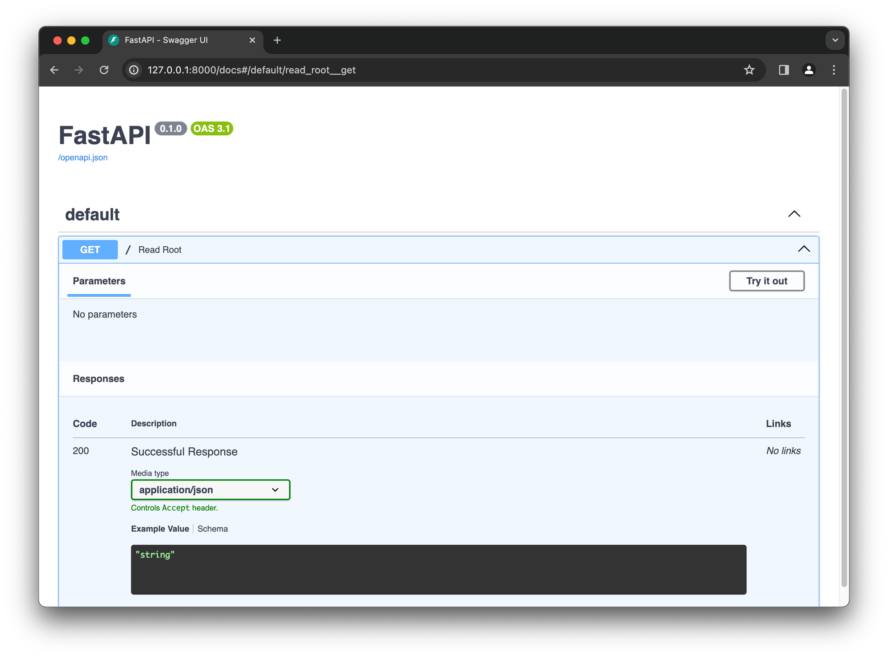

## Introduction and basics

### 👉 Overview of FastAPI [🔗](https://fastapi.tiangolo.com/)

FastAPI is a modern, fast (high-performance), web framework for building APIs with Python 3.8+ based on standard Python type hints.

### 👉 Installation and project setup

```bash
# Create a new virtual environment
python3 -m venv .venv

# Activate the virtual environment
source .venv/bin/activate

# Install FastAPI
pip install fastapi

# Install Uvicorn
pip install "uvicorn[standard]"

# Deactivate de virtual environment
deactivate
```

### 👉 Creating your first FastAPI application

```bash
# Run de application
uvicorn main:app --reload

INFO:     Will watch for changes in these directories: ['/Users/miguelangel/Developer/code/fastapi-masterclass']
INFO:     Uvicorn running on http://127.0.0.1:8000 (Press CTRL+C to quit)
INFO:     Started reloader process [35238] using WatchFiles
INFO:     Started server process [35244]
INFO:     Waiting for application startup.
INFO:     Application startup complete.
INFO:     127.0.0.1:51119 - "GET / HTTP/1.1" 200 OK
INFO:     127.0.0.1:51119 - "GET /favicon.ico HTTP/1.1" 404 Not Found
```


