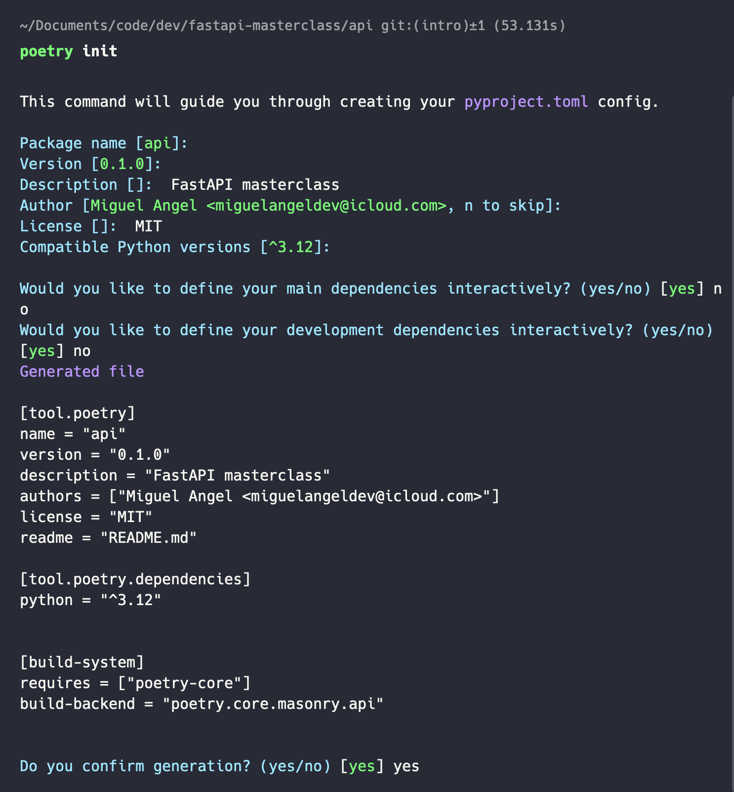
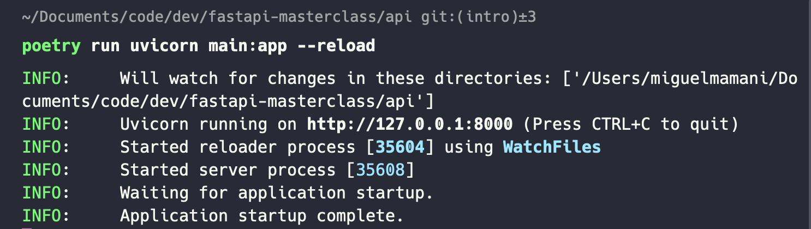

## Managing Dependencies with Poetry and API Testing with Ruff

## Introduction to Poetry [🔗](https://python-poetry.org/)
Dependency management is among the most fundamental aspects of Python projects. It can soon turn into a nightmare especially when a package is maintained by many developers. It is therefore quite important to make use of the right tools that could eventually help the maintainers of a project to handle dependencies the right way.

### 👉🏻 What is Poetry
Poetry, is a dependency management and packaging tool for Python projects. In other words, poetry will handle the dependencies that you have defined in your `pyproject.toml` file.

### 👉🏻 The pyproject.toml file
For a long time, `setuptools` was the “de facto” tool being used to manage dependencies in Python projects. This, however, has changed since the proposition of [PEP-518](https://peps.python.org/pep-0518/). This Python Enhancement Proposal introduced a TOML file called `pyproject.toml` that would essentially contain all build system dependencies for each project.

### 👉🏻 Installation
```bash
python3 -m venv $VENV_PATH

curl -sSL https://install.python-poetry.org | python3 -

export PATH="/Users/miguelmamani/.local/bin:$PATH"

# Zsh
poetry completions zsh > ~/.zfunc/_poetry

## ~/.zshrc
fpath+=~/.zfunc
autoload -Uz compinit && compinit

# Oh My Zsh
mkdir $ZSH_CUSTOM/plugins/poetry
poetry completions zsh > $ZSH_CUSTOM/plugins/poetry/_poetry

## ~/.zshrc
plugins(
        poetry
        ...
        )
```

### 👉 Project setup

```bash
cd pre-existing-project
poetry init
```



### 👉 Overview
```toml
[tool.poetry]
name = "api"
version = "0.1.0"
description = "FastAPI masterclass"
authors = ["Miguel Angel <miguelangeldev@icloud.com>"]
license = "MIT"
readme = "README.md"

[tool.poetry.dependencies]
python = "^3.12"


[build-system]
requires = ["poetry-core"]
build-backend = "poetry.core.masonry.api"
```

The first section (`[tool.poetry]`) contains some general information about your project (these details will also be used if `poetry` is used to publish your package on PyPI.

The second part `[tool.poetry.dependencies]` is used to specify the Python version as well as the package dependencies, either mandatory or optional dependencies.

Finally, the last section of the `pyproject.toml` file generated by `poetry` is called `[build-system]`. poetry is compliant with [PEP-517](https://peps.python.org/pep-0517/) that introduces a new standard way for specifying build systems when maintaining a project. Therefore this section, is used to specify the specific build system (for example this could be `setuptools` or `poetry`):

### 👉 Installing dependencies with poetry

```bash
poetry install
```

```bash
poetry add fastapi
poetry add uvicorn
```

- **If for any reason you want to activate the environment you can simply create a new shell by running**

```bash
poetry shell
```

- **Displaying the environment information**

```bash
poetry env list
poetry env info
```

- **The `run` command executes the given command inside the project’s virtualenv.**

```bash
poetry run uvicorn main:app --reload
```




Learn about Poetry, a dependency management and packaging tool for Python.
Install Poetry and initialize a new project.
Understand how Poetry simplifies dependency management and project packaging.

### Managing Project Dependencies with Poetry
Dive deeper into managing dependencies with Poetry.
Add FastAPI and other necessary dependencies to your project using Poetry.
Explore Poetry's features like version constraints, dependency resolution, and lock files.

### Creating a FastAPI Project with Poetry
Combine your knowledge of FastAPI with Poetry.
Set up a new FastAPI project using Poetry for dependency management.
Configure project structure and dependencies effectively.

### Introduction to API Testing with Ruff
Learn about Ruff, a Python library for API testing.
Understand the importance of automated testing in API development.
Install Ruff and set up a basic testing environment.

### Writing API Tests with Ruff
Start writing API tests using Ruff.
Create test cases to verify endpoint functionality, request validation, and response formats.
Explore Ruff's features for test organization, assertions, and fixtures.
