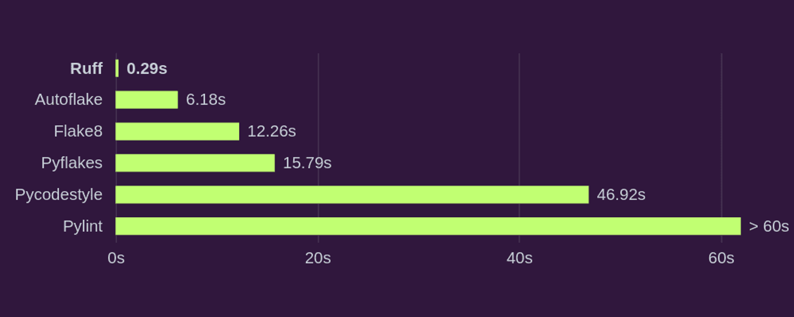

## Managing Dependencies with Poetry and API Testing with Ruff

## Introduction to Poetry [🔗](https://python-poetry.org/)
Dependency management is among the most fundamental aspects of Python projects. It can soon turn into a nightmare especially when a package is maintained by many developers. It is therefore quite important to make use of the right tools that could eventually help the maintainers of a project to handle dependencies the right way.

### 👉🏻 What is Poetry
Poetry, is a dependency management and packaging tool for Python projects. In other words, poetry will handle the dependencies that you have defined in your `pyproject.toml` file.

### 👉🏻 The pyproject.toml file
For a long time, `setuptools` was the “de facto” tool being used to manage dependencies in Python projects. This, however, has changed since the proposition of [PEP-518](https://peps.python.org/pep-0518/). This Python Enhancement Proposal introduced a TOML file called `pyproject.toml` that would essentially contain all build system dependencies for each project.

### 👉🏻 Installation
```bash
python3 -m venv $VENV_PATH

curl -sSL https://install.python-poetry.org | python3 -

export PATH="/Users/miguelmamani/.local/bin:$PATH"

# Zsh
poetry completions zsh > ~/.zfunc/_poetry

## ~/.zshrc
fpath+=~/.zfunc
autoload -Uz compinit && compinit

# Oh My Zsh
mkdir $ZSH_CUSTOM/plugins/poetry
poetry completions zsh > $ZSH_CUSTOM/plugins/poetry/_poetry

## ~/.zshrc
plugins(
        poetry
        ...
        )
```

### 👉 Project setup

```bash
cd pre-existing-project
poetry init
```


### 👉 Overview
```toml
[tool.poetry]
name = "api"
version = "0.1.0"
description = "FastAPI masterclass"
authors = ["Miguel Angel <miguelangeldev@icloud.com>"]
license = "MIT"
readme = "README.md"

[tool.poetry.dependencies]
python = "^3.12"


[build-system]
requires = ["poetry-core"]
build-backend = "poetry.core.masonry.api"
```

The first section (`[tool.poetry]`) contains some general information about your project (these details will also be used if `poetry` is used to publish your package on PyPI.

The second part `[tool.poetry.dependencies]` is used to specify the Python version as well as the package dependencies, either mandatory or optional dependencies.

Finally, the last section of the `pyproject.toml` file generated by `poetry` is called `[build-system]`. poetry is compliant with [PEP-517](https://peps.python.org/pep-0517/) that introduces a new standard way for specifying build systems when maintaining a project. Therefore this section, is used to specify the specific build system (for example this could be `setuptools` or `poetry`):

### 👉 Installing dependencies with poetry

```bash
poetry install
```

```bash
poetry add fastapi
poetry add uvicorn
```

- **If for any reason you want to activate the environment you can simply create a new shell by running**

```bash
poetry shell
```

- **Displaying the environment information**

```bash
poetry env list
poetry env info
```

- **The `run` command executes the given command inside the project’s virtualenv.**

```bash
poetry run uvicorn main:app --reload
```


## Introduction to Ruff [🔗](https://docs.astral.sh/ruff/)

Writing clean and error-free Python code is crucial for maintaining code quality, readability, and reliability in software development projects. This is where Python linters come into play, and among them, Ruff stands out as a powerful tool for ensuring your Python code adheres to best practices and coding standards.

Ruff is a relatively new Python linter that has gained immense popularity over the years due to its speed and integration of multiple linters. Ruff is open source, making it accessible to developers of all levels. It supports integration with popular code editors like Visual Studio Code, Sublime Text, and PyCharm. While Ruff may be relatively new, it benefits from active development and a growing community and has the capabilities to replace [Flake8](https://pypi.org/project/flake8/) (plus dozens of plugins), [isort](https://pypi.org/project/isort/), [pydocstyle](https://pypi.org/project/pydocstyle/), [yesqa](https://github.com/asottile/yesqa), [eradicate](https://pypi.org/project/eradicate/), [pyupgrade](https://pypi.org/project/pyupgrade/), and [autoflake](https://pypi.org/project/autoflake/). Moreover, developers are continually improving the tool and adding new features, making it a promising choice for the future.



### 👉 Installation

```bash
poetry add ruff
```

```bash
# Check the code
ruff check .

# Fix the code
ruff check --fix .

# Lint all files in `/path/to/code` (and any subdirectories)
$ ruff check path/to/code/

# Lint all `.py` files in `/path/to/code`
$ ruff check path/to/code/*.py

# Lint `file.py`
$ ruff check path/to/code/to/file.py

# Watch mode
ruff check path/to/code/ --watch
```

### 👉 Configuration

To configure Ruff, you will use a *ruff.toml* file or a *pyproject.toml* file. All configurations in this file will be under the section `[tool.ruff]`. By default Ruff supports pyflakes and pycodestyle rules (the basis of Flake8) but you can configure more rules from more than [40 plugins](https://beta.ruff.rs/docs/rules/) implemented like [pyupgrade](https://pypi.org/project/pyupgrade/) and [isort](https://pycqa.github.io/isort/) (yes you can even sort imports with Ruff!).

```toml
[tool.ruff]
line-length = 120
output-format = "grouped"
extend-exclude = ["alembic"]

[tool.ruff.lint]
select = [
    "E",   # pycodestyle errors
    "W",  # pycodestyle warnings
    "F",   # pyflakes
    "UP",  # pyupgrade,
    "I",   # isort
    "D4",  # flake8-docstrings
    "PT",  # flake8-pytest
    "PL",  # flake8-pytest-style
    "Q",  # flake8-quotes
    "C",  # flake8-comprehensions
    "B",  # flake8-bugbear
]
ignore = ["D401", "D417"]

[tool.ruff.lint.flake8-quotes]
inline-quotes = "single"
multiline-quotes = "double"
docstring-quotes = "double"

[tool.ruff.format]
# Use single quotes rather than double quotes.
quote-style = "single"
```

### 👉 **Ignoring errors**

- On line level

```python
def sum_even_numbers(numbers: List[int]) -> int:  # noqa: UP006
                pass
```

- On the entire file

```python
# ruff: noqa: UP006
from typing import List
```

- In the configuration file

```toml
# Enable flake8-bugbear (`B`) rules.
select = ["E", "F", "B"]

# Never enforce `E501` (line length violations).
ignore = ["E501"]

# Avoid trying to fix flake8-bugbear (`B`) violations.
unfixable = ["B"]

# Ignore `E402` (import violations) in all `__init__.py` files, and in `path/to/file.py`.
[per-file-ignores]
"__init__.py" = ["E402"]
"path/to/file.py" = ["E402"]
```

### 👉 CI / CD

To help with your workflow, Ruff comes with a [pre-commit](https://docs.astral.sh/ruff/integrations/#pre-commit) hook you can use.

```yaml
- repo: https://github.com/charliermarsh/ruff-pre-commit
  # Ruff version.
  rev: 'v0.0.257'
  hooks:
    - id: ruff

# Enabling auto-fix

- repo: https://github.com/charliermarsh/ruff-pre-commit
  # Ruff version.
  rev: 'v0.0.258'
  hooks:
    - id: ruff
      args: [--fix, --exit-non-zero-on-fix]
```

### 🔗 Resources
[Poetry: finally an all-in-one tool to manage python packages](https://medium.com/analytics-vidhya/poetry-finally-an-all-in-one-tool-to-manage-python-packages-3c4d2538e828)

[Integrations - Ruff](https://docs.astral.sh/ruff/integrations/#vs-code-official)

[Python: lint code faster](https://lewoudar.medium.com/python-lint-code-faster-91f0e04ee6fc)
