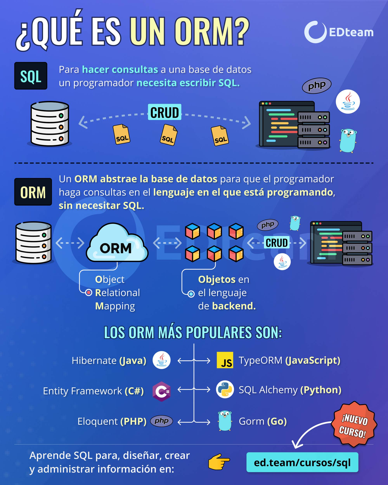

## ORM

### 👉 What is ORM?

Object-Relational Mapping (ORM) is a programming technique for converting data between incompatible type systems using object-oriented programming languages. This creates a "virtual object database" that can be used from within the programming language.

### 👉 Why use ORM?

ORMs provide a high-level abstraction upon a relational database that allows a developer to write Python code instead of SQL to create, read, update, and delete data and schemas in their database. This leads to a more productive and easier-to-maintain codebase.



## SQLAlchemy [🔗](https://www.sqlalchemy.org/)

### 👉 What is SQLAlchemy?

SQLAlchemy is a SQL toolkit and Object-Relational Mapping (ORM) library for Python. It provides a full suite of well-known enterprise-level persistence patterns, designed for efficient and high-performing database access, adapted into a simple and Pythonic domain language.

### 👉 Installation [🔗](https://fastapi.tiangolo.com/tutorial/sql-databases/)

```bash
poetry add psycopg2-binary
poetry add sqlalchemy
```

### 👉 Connecting to the Database

```python
from sqlalchemy import create_engine
from sqlalchemy.ext.declarative import declarative_base
from sqlalchemy.orm import sessionmaker

SQLALCHEMY_DATABASE_URL = 'postgresql://<user>:<secret>@<host>:<port>/<database>'

engine = create_engine(SQLALCHEMY_DATABASE_URL)

SessionLocal = sessionmaker(autocommit=False, autoflush=False, bind=engine)

Base = declarative_base()

def get_db():
    db = SessionLocal()
    try:
        yield db
    finally:
        db.close()
```

### 👉 Creating a Model

```python
from sqlalchemy import TIMESTAMP, Boolean, Column, Integer, String, text

from .database import Base


class Post(Base):
    __tablename__ = 'posts'

    id = Column(Integer, primary_key=True, nullable=False)
    title = Column(String, nullable=False)
    content = Column(String, nullable=False)
    published = Column(Boolean, nullable=False, server_default='TRUE')
    created_at = Column(TIMESTAMP(timezone=True), nullable=False, default=text('NOW()'))
    updated_at = Column(TIMESTAMP(timezone=True), nullable=False, default=text('NOW()'), onupdate=text('NOW()'))
```

### 👉 CRUD Operations

```python
from sqlalchemy.orm import Session

from . import models


def get_post(db: Session, post_id: int):
    return db.query(models.Post).filter(models.Post.id == post_id).first()


def get_posts(db: Session, skip: int = 0, limit: int = 10):
    return db.query(models.Post).offset(skip).limit(limit).all()


def create_post(db: Session, post: models.Post):
    db.add(post)
    db.commit()
    db.refresh(post)
    return post
```

### 👉 Schemas

```python
from pydantic import BaseModel


class PostBase(BaseModel):
    title: str
    content: str


class PostCreate(PostBase):
    pass
```
